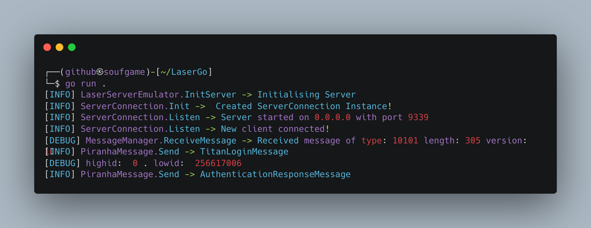

# LaserGo
First Ever Open Source Brawl Stars Server Core Written in Go

## Usage

## Notes
- **DO NOT USE THIS FOR PRODUCTION ITS ABSOLUTLY BROKEN**
- This is my first experience with Golang and... **MY CODE IS ABSOLUTE WHEELCHAIRED**, yeah.. maybe when i'll learn more about Golang i'll fix that code.